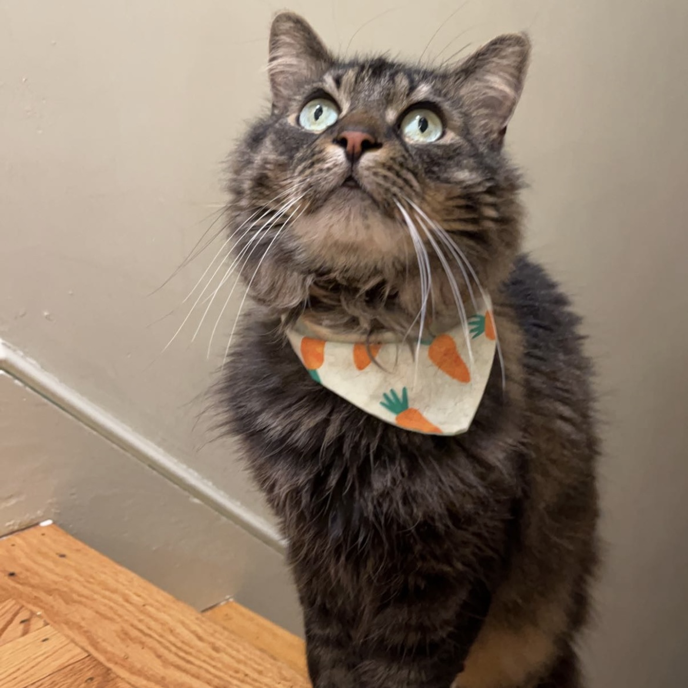
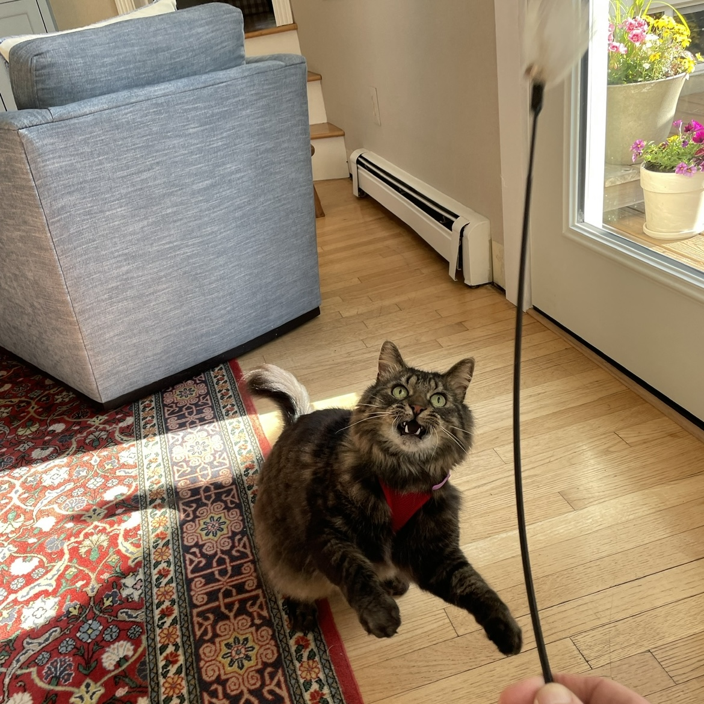
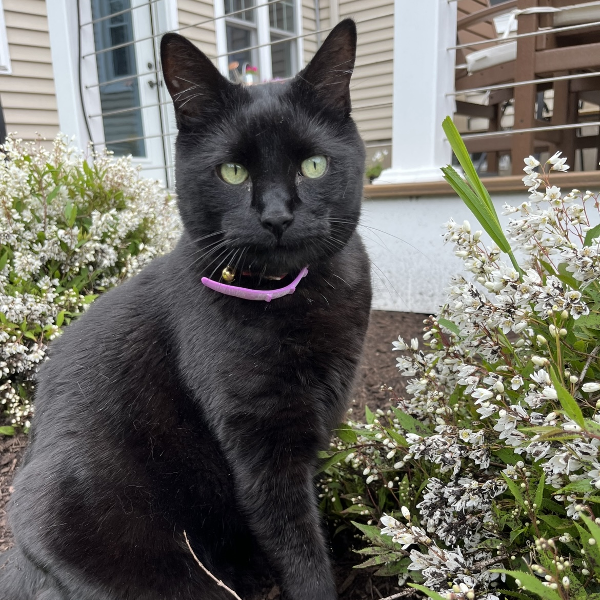
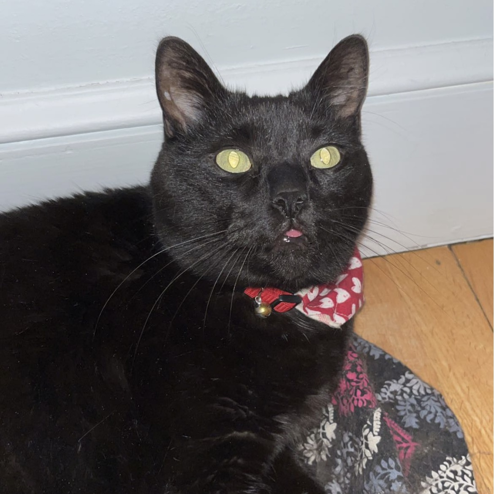
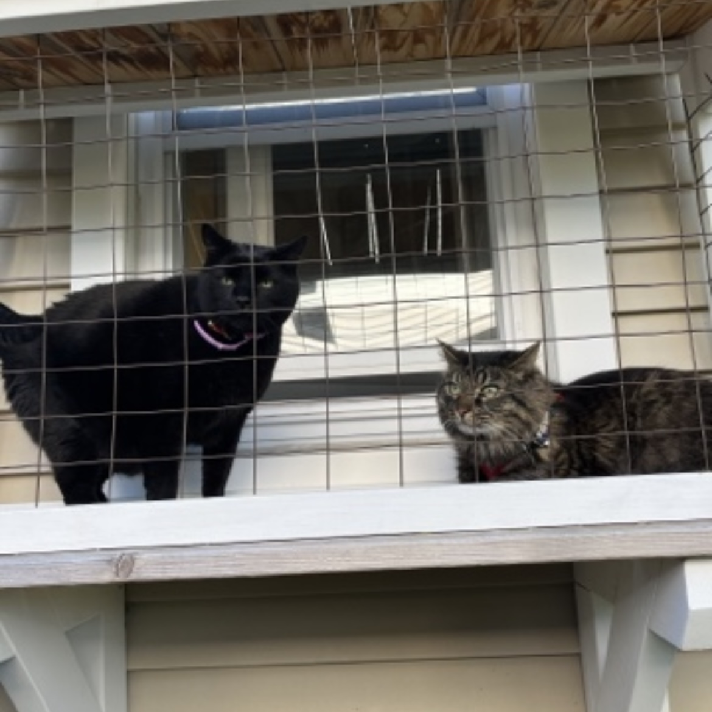
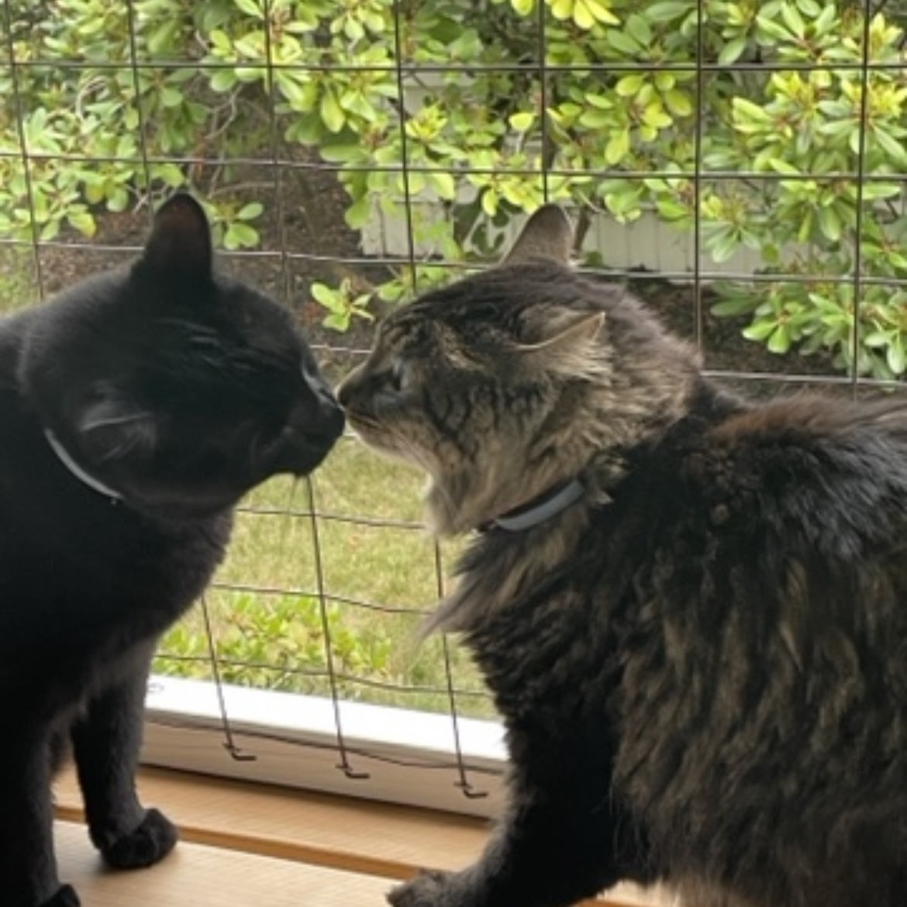

<!DOCTYPE html>
<html lang="en">
<head>
    <meta charset="UTF-8">
    <meta http-equiv="X-UA-Compatible" content="IE=edge">
    <meta name="viewport" content="width=device-width, initial-scale=1.0">
    <title>Jimmy and Lester!</title>
    <link rel="stylesheet" href="styles/main.css">
</head>
<body>
    <header>
        <h1>Jimmy and Lester!</h1>
    </header>
    <main>
        

            
            
This is Jimmy. He is a Maine Coon and Tabby mix and we adopted him when he was three months. The Maine Coon is a large domesticated cat breed. It is one of the oldest natural breeds in North America. The breed originated in the U.S. state of Maine, where it is the official state cat. A tabby is any domestic cat with a distinctive 'M'-shaped marking on its forehead; stripes by its eyes and across its cheeks, along its back, and around its legs and tail; and, characteristic striped, dotted, lined, flecked, banded, or swirled patterns on the body—neck, shoulders, sides, flanks, chest, and abdomen.

        

        <section>    
            
            
Another picture of Jimmy. Jimmy loves to play and is very energetic. He loves to pounce on laser pointers, feathers, and ribbon. His favorite toy is a rainbow. After he gets tired from playing, Jimmy likes to hide in closets and clothes drawers.

        </section>
        

            
            
This is Lester. He is a Bombay cat that we adopted when he was six. The Bombay cat is a type of short-haired cat developed by breeding sable Burmese and black American Shorthair cats, to produce a cat of mostly Burmese type, but with a sleek, panther-like black coat. Bombay is the name given to black cats of the Asian group.

        

        <section>
            
            
Another picture of Lester. Lester likes to explore outside under supervision and he loves to roam through our garden while eating all from the catnip plant. Lesters fsvorite toy is a banana. After being outside gets him tired, Lester likes to sleep in chairs or on vera bradley bags.

        </section>
        

            
            
You may notice two cats spending a lot of time together. This is usually a good indicator that they've formed a bond. You often see this with siblings or cats housed together in a shelter or a furever home. Their favorite activity to do together is hang out on their catio (cat-patio). They love to get fresh air and watch as people, animals, and birds go by.

        

        <section>
            
            
The cat is a domestic species of small carnivorous mammal. It is the only domesticated species in the family Felidae and is commonly referred to as the domestic cat or house cat to distinguish it from the wild members of the family. My cats first met eachother in 2020 and haven't been seperated since. They also love to have matching outfits for every occasion.

        </section>
    </main>
    <footer>
        
&copy; 2023 Julia Duggan

    </footer>
</body>
</html>
